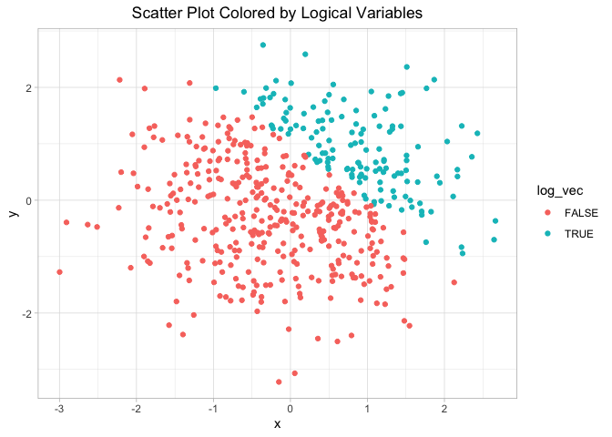
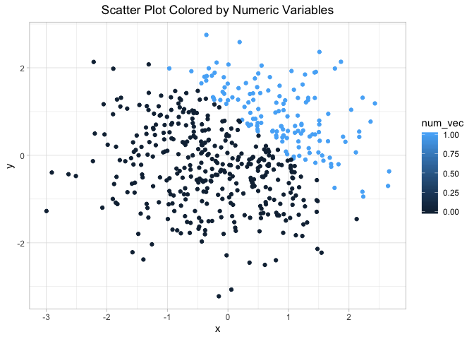
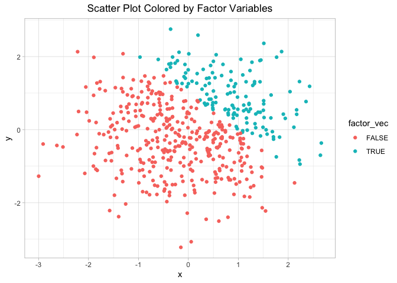

hw\_1\_zl2860
================
Zongchao Liu
9/15/2019

# Problem 0.1

## STEP 1: Create a dataframe

``` r
#----------STEP 1: Create a dataframe
set.seed(886) # set.seed() to ensure the reproductivity
df_1 <- tibble(
  random_sample = rnorm(8), # create a random sample of size 8 from a standard Normal distribution
  vec_logical = random_sample > 0, # create a logical vector indicating whether elements of the sample are greater than 0
  vec_character = as.character(c("a","a","a","a","a","a","a","a")), # create a character vector of length 8
  vec_factor = factor(c("good","bad","medium","good","bad","medium","bad","medium"),
                      levels = c("good","medium","bad"))
) #create a factor vector of length 8, with 3 different factor levels

levels(pull(df_1,vec_factor)) #see the levels of the created factor vector
```

    ## [1] "good"   "medium" "bad"

## STEP 2: Take the mean of each variable in the dataframe

``` r
#----------STEP 2: Take the mean of each variable in the dataframe
mean(pull(df_1,random_sample)) # return numeric values
```

    ## [1] 0.4674804

``` r
mean(pull(df_1,vec_logical)) # return numeric values
```

    ## [1] 0.75

``` r
mean(pull(df_1,vec_character)) # return NAs
```

    ## Warning in mean.default(pull(df_1, vec_character)): argument is not numeric
    ## or logical: returning NA

    ## [1] NA

``` r
mean(pull(df_1,vec_factor)) # return NAs
```

    ## Warning in mean.default(pull(df_1, vec_factor)): argument is not numeric or
    ## logical: returning NA

    ## [1] NA

The function mean() works on the columns with values that can be treated
as numeric ones(\[‘random\_sample’\] and \[‘vec\_logical’\]) but doesn’t
work on the vector of characters or
factors(\[‘vec\_character’\],\[‘vec\_factor’\]).

## STEP 3.1: Convert data type

``` r
#----------STEP 3: Convert data type & Multiplication
#STEP 3.1:  Convert data type
as.numeric(pull(df_1,vec_logical)) # return numeric values
as.numeric(pull(df_1,vec_character)) # return NAs
as.numeric(pull(df_1,vec_factor)) # return numeric values
```

The vectors of logical values and factors can be converted to vectors of
numeric values. In R, logical values are mathematically corresponding to
the number 0 and 1(TRUE = 1 , FALSE =0). However, this does not mean
TRUE is greater than FALSE. Similarly, levels of factors are
mathematically corresponding to the number 1,2,3…n. Before calculation,
R will try to ensure the values are numeric. When we perform
calculations on logical variables, R will force logical values to become
numbers and calculate the results. The range of the mean of a seris of
TRUEs and FALSEs is (0,1), indicating the proportion of the two values.
However, even factors can be converted to numeric values, the mean of
the values shows no significance. Therefore, taking the mean of factors
is not allowed and helpless.

In fact, vectors of characters can be converted to numeric values only
when the characters are all numbers. However, converting number
characters to numeric values runs the risk of missing information if the
original characters have many decimal places.

## STEP 3.2: Convert data type & Multiplication

``` r
#STEP 3.2: Convert data type & Multiplication
result1 =  as.numeric(pull(df_1,vec_logical)) * pull(df_1,random_sample) # convert the logical vector to numeric, and multiply the random sample by the result
result2 = as.factor(pull(df_1,vec_logical)) * pull(df_1,random_sample) # convert the logical vector to a factor, and multiply the random sample by the result
```

    ## Warning in Ops.factor(as.factor(pull(df_1, vec_logical)), pull(df_1,
    ## random_sample)): '*' not meaningful for factors

``` r
result3 = as.numeric(as.factor(pull(df_1,vec_logical))) * pull(df_1,random_sample) # convert the logical vector to a factor and then convert the result to numeric, and multiply the random sample by the result
```

# Promblem 2

## Create a new dataframe & Write a short description of the vectors using inline R code

``` r
set.seed(886)
#Create a data frame 
df_2 <- tibble(
  x = rnorm(500), # x: a random sample of size 500 from a standard Normal distribution
  y = rnorm(500), # y: a random sample of size 500 from a standard Normal distribution
  log_vec = x+y >1, # A logical vector indicating whether x + y > 1
  num_vec = as.numeric(log_vec),# A numeric vector created by coercing the above logical vector
  factor_vec = as.factor(log_vec)# A factor vector created by coercing the above logical vector
)
```

The size of the data is (500 ,5). The mean of x is 0.0288533. The median
of x is 0.0173867. The standard deviation of x is 1.0174585. The
proportion of x is 0.28

## Make scatterplots

``` r
ggplot(df_2, aes(x = x, y = y, color = log_vec ))+geom_point()+
  labs(x="x",y="y", title = "Scatter Plot Colored by Logical Variables")+
  theme_light()+
  theme(plot.title = element_text(hjust = 0.5))
```

<!-- -->

``` r
  # a scatterplot of y vs x; color points using the logical variable

ggsave("colored_by_logical_variables.pdf") #export the image
```

    ## Saving 7 x 5 in image

``` r
ggplot(df_2, aes(x = x, y = y, color = num_vec ))+geom_point()+
  labs(x="x",y="y", title = "Scatter Plot Colored by Numeric Variables")+
  theme_light()+
  theme(plot.title = element_text(hjust = 0.5))
```

<!-- -->

``` r
ggplot(df_2, aes(x = x, y = y, color = factor_vec ))+geom_point()+
  labs(x="x",y="y", title = "Scatter Plot Colored by Factor Variables")+
  theme_light()+
  theme(plot.title = element_text(hjust = 0.5)) # a second and third scatterplot that color points using the numeric and factor variables, respectively
```

<!-- -->

## About the color scale

There are only two colors in the color scales of the plots colored by
logical and factor variables because these two kinds of variables are
treated as discrete values while being plotted. The color scale of these
two plots should be like categories. For the plot colored by numeric
variables, the color scale is a spectrum with gradual changes of the
colors. This is because the numeric values are treated as continuous
values while being plotted. However, the points in the plots only show
two kinds of colors since there are only two values(0 and 1) in the
column of the numeric variable.
